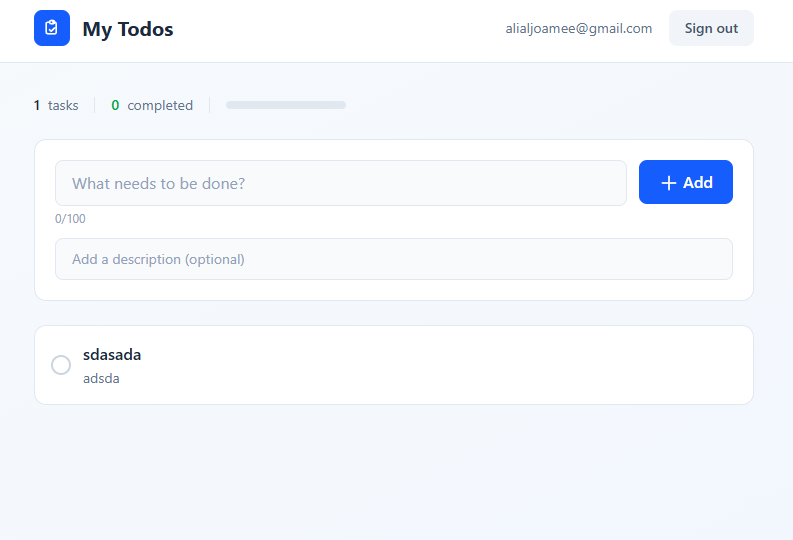
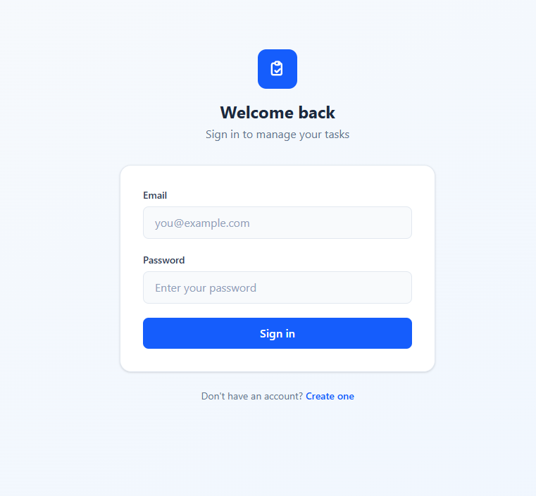
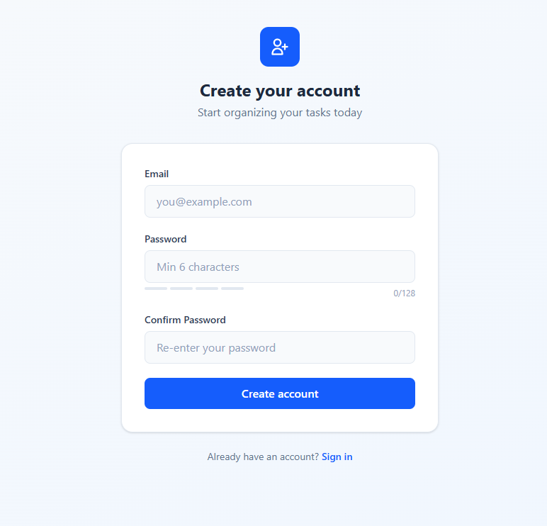
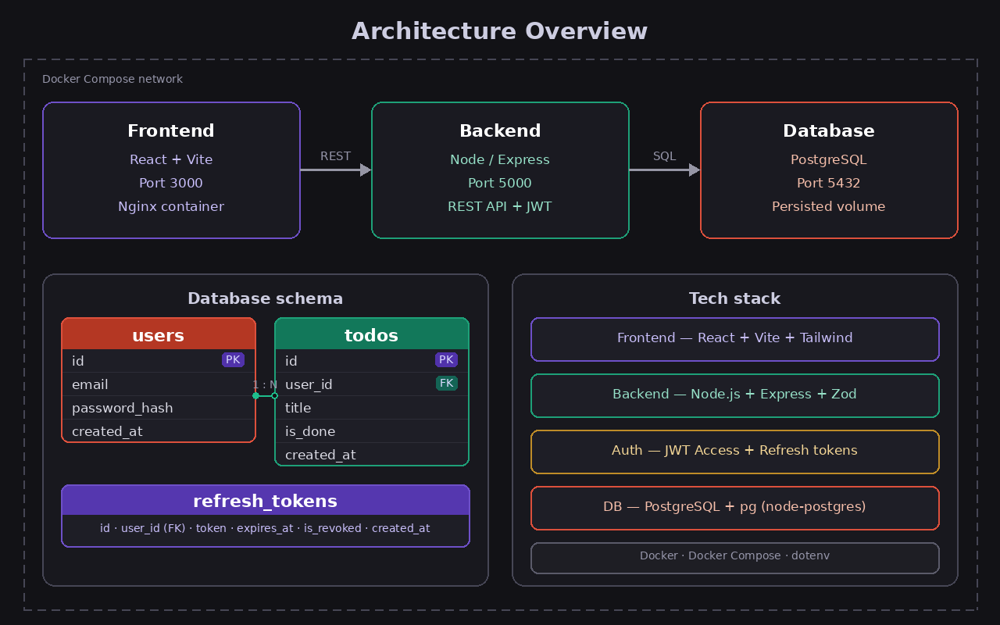
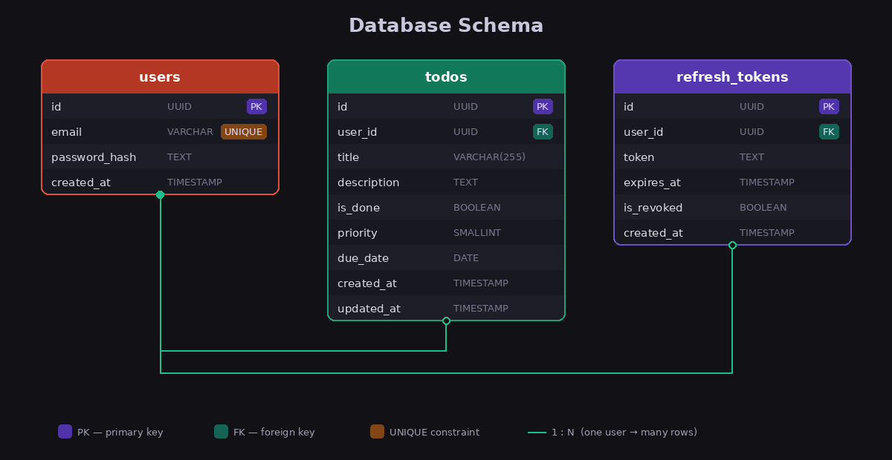

# ToDo Application

A full-stack, containerized task management app with secure JWT authentication — built with React, Node.js, and PostgreSQL.



---

## About

This application allows users to register, log in, and manage personal to-do items through a clean, modern interface. Each user's data is fully isolated — you can only see and modify your own tasks.

The project is structured as a **multi-tier architecture** with three independent, containerized services communicating over a Docker network.

<table>
<tr>
<td width="50%">

### Login

Secure email/password authentication with JWT tokens. Invalid credentials and validation errors are shown inline.



</td>
<td width="50%">

### Register

New users create an account with email and password. Includes a password strength indicator and real-time confirmation matching.



</td>
</tr>
</table>

---

## Quick Start

### Prerequisites

- [Docker Desktop](https://www.docker.com/products/docker-desktop/) (includes Docker Compose)
- [Git](https://git-scm.com/)

### 1. Clone & configure

```bash
git clone https://github.com/A-Aljami/todo-list.git
cd todo-list
cp .env.example .env
```

### 2. Start the application

```bash
docker compose up --build
```

Wait until all three services are running, then open:

| Service | URL |
|---------|-----|
| Frontend | http://localhost:3000 |
| Backend API | http://localhost:5001/api |
| Health Check | http://localhost:5001/api/health |

### 3. Stop the application

```bash
docker compose down        # stop containers
docker compose down -v     # stop + reset database
```

---

## Running Tests

The project includes a comprehensive API test suite (31 tests) covering authentication, CRUD operations, input validation, security headers, and cross-user data isolation.

```bash
# Make sure containers are running first
docker compose up -d

# Run the test suite
bash tests/api.test.sh
```

**Test coverage:**

| Category | Tests |
|----------|-------|
| Health check | 2 |
| Registration (valid, duplicate, invalid) | 5 |
| Login (valid, wrong password, nonexistent) | 3 |
| Auth protection (no token, bad token) | 2 |
| Todo CRUD (create, read, update, delete) | 6 |
| Input validation (empty, missing, bad JSON) | 3 |
| Token refresh & logout | 4 |
| Security headers (Helmet) | 3 |
| SQL injection prevention | 1 |
| Cross-user data isolation | 2 |
| **Total** | **31** |

---

## Tech Stack

| Layer | Technology |
|-------|-----------|
| Frontend | React 19, TypeScript, Vite, Tailwind CSS |
| Backend | Node.js 22, Express 5, TypeScript, Zod 4 |
| Database | PostgreSQL 16 |
| Auth | JWT (jsonwebtoken), bcryptjs |
| Security | Helmet.js, express-rate-limit, CORS |
| DevOps | Docker, Docker Compose, Nginx |

---

## Architecture



Three containerized services running in a Docker Compose network:

- **Frontend** — React SPA built with Vite, served by Nginx on port 3000. Handles routing, auth state, and API communication via Axios with automatic token refresh.
- **Backend** — Express REST API on port 5000. Manages authentication, todo CRUD, input validation (Zod), and security middleware (Helmet, rate limiting).
- **Database** — PostgreSQL 16 with a persisted volume. Schema is auto-initialized on first boot via `docker-entrypoint-initdb.d`.

---

## Database Schema



Three tables with UUID primary keys and foreign key relationships:

| Table | Purpose |
|-------|---------|
| **users** | Stores credentials with bcrypt-hashed passwords (12 rounds) |
| **todos** | Task data linked to users via `user_id` FK with CASCADE delete |
| **refresh_tokens** | JWT refresh tokens with expiry tracking and revocation |

Performance indexes on `todos.user_id`, `refresh_tokens.user_id`, and `refresh_tokens.token`.

---

## Authentication

The app uses a **dual-token JWT strategy** for secure, stateless authentication:

| Token | Lifetime | Storage | Purpose |
|-------|----------|---------|---------|
| Access Token | 15 minutes | localStorage | Sent with every API request |
| Refresh Token | 7 days | localStorage + database | Used to obtain new access tokens |

**Flow:**
1. User logs in → server issues access + refresh tokens
2. Access token expires → Axios interceptor automatically calls `/auth/refresh`
3. Old refresh token is **revoked**, new pair issued (token rotation)
4. On logout, refresh token is revoked server-side

---

## Security

| Feature | Implementation |
|---------|---------------|
| Password hashing | bcrypt, 12 salt rounds |
| HTTP headers | Helmet.js (CSP, HSTS, X-Content-Type-Options) |
| Rate limiting | 100 req/15 min on auth endpoints |
| CORS | Restricted to frontend origin |
| Input validation | Zod schemas on all request bodies |
| SQL injection | Parameterized queries (pg) |
| User isolation | All queries filter by `user_id` |
| Error handling | Global handler, no stack trace leaks |

---

## API Endpoints

### Auth
| Method | Endpoint | Description |
|--------|----------|-------------|
| POST | `/api/auth/register` | Register a new user |
| POST | `/api/auth/login` | Login and receive tokens |
| POST | `/api/auth/refresh` | Refresh access token |
| POST | `/api/auth/logout` | Revoke refresh token |

### Todos *(requires `Authorization: Bearer <token>`)*
| Method | Endpoint | Description |
|--------|----------|-------------|
| GET | `/api/todos` | Get all todos for current user |
| POST | `/api/todos` | Create a new todo |
| PUT | `/api/todos/:id` | Update a todo |
| DELETE | `/api/todos/:id` | Delete a todo |

---

## Project Structure

```
todo-list/
├── backend/
│   ├── src/
│   │   ├── index.ts                # Express app + middleware
│   │   ├── db.ts                   # PostgreSQL connection pool
│   │   ├── routes/
│   │   │   ├── auth.ts             # Register, login, refresh, logout
│   │   │   └── todos.ts            # CRUD endpoints
│   │   ├── middleware/
│   │   │   └── auth.ts             # JWT verification middleware
│   │   └── validators/
│   │       ├── auth.ts             # Zod schemas for auth
│   │       └── todos.ts            # Zod schemas for todos
│   ├── Dockerfile
│   ├── package.json
│   └── tsconfig.json
├── frontend/
│   ├── src/
│   │   ├── api/axios.ts            # Axios instance + interceptors
│   │   ├── context/
│   │   │   ├── AuthContext.ts       # Auth context definition
│   │   │   └── AuthProvider.tsx     # Auth state management
│   │   ├── hooks/useAuth.ts        # Auth hook
│   │   ├── pages/
│   │   │   ├── Login.tsx
│   │   │   ├── Register.tsx
│   │   │   └── Dashboard.tsx
│   │   ├── components/
│   │   │   ├── AddTodo.tsx
│   │   │   └── TodoItem.tsx
│   │   └── App.tsx                 # Router + route guards
│   ├── nginx.conf                  # Nginx SPA config
│   ├── Dockerfile                  # Multi-stage build + Nginx
│   └── package.json
├── database/
│   └── schema.sql                  # PostgreSQL schema (auto-init)
├── docs/                           # Architecture & schema diagrams
├── tests/
│   └── api.test.sh                 # API test suite (31 tests)
├── docker-compose.yml
├── .env.example
└── .gitignore
```
